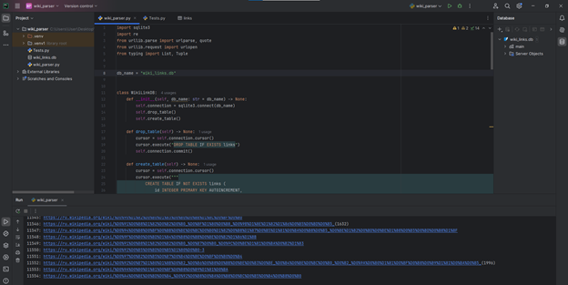
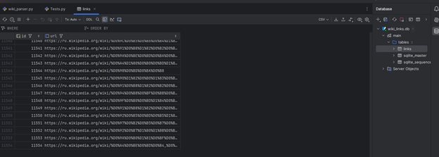

# pt_blackbox


# Использование утилиты

## Общий вид команды для запуска парсера имеет следующую структуру, где url - ссылка страницы в википедии, а deep - глубина обхода:
```python wiki_parser.py url deep```

## Так для запуска парсера на глубину 6 по ссылке https://ru.wikipedia.org/wiki/Positive_Technologies необходимо написать следующее:
```python wiki_parser.py "https://ru.wikipedia.org/wiki/Positive_Technologies" 6```

# Для справки

При запуске программы по ссылке на глубину 3, обход занял n-часов(точно больше 6 часов и файл с бд имел вес 115мб), но так и не дождавшись, я завершил выполнение. Даже при обходе ссылки с глубиной 3 бд имела ~400к уникальных ссылок. Для написания тестов использовались mock-функции, чтобы исключить выход во внешнюю систему, чтобы сократить количество ссылок и проверить функционал. 

# Скриншоты выполнения команды на глубину 2

## Успешное сохранение 11000 ссылок в базу данных



## Внешний вид базы данных с теми же данными



